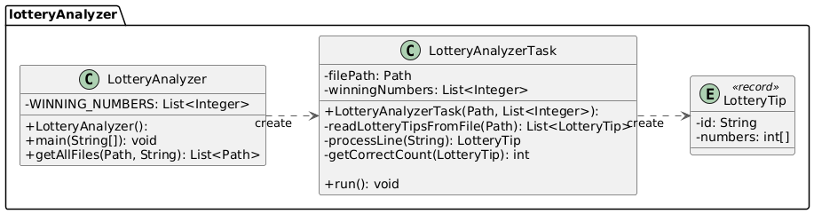

= Lottoauswertung

Beim Lotto 6 aus 45 werden 6 Gewinnzahlen gezogen. Spieler können zuvor Tipps abgeben. Die Gewinnklasse hängt davon ab, wie viele Zahlen richtig getippt wurden. Bei einem 5er wurden z. B. 5 richtige Zahlen getippt.

Lottotipps werden auf Lottoscheinen in Annahmestellen abgegeben. Jeder Lottoschein kann max. 20 Lottotipps erfassen. Für eine Ziehung werden die Lottotipps einer Annahmestelle in einer Datei gespeichert. Es existieren also pro Annahmestelle eine Detai (Dateiname: dreistelliger Code der Annahmestelle). Alle Dateien sind im Verzeichnis `files` abgelegt. Die Dateien enthalten die Lottotipps in folgendem Format: `ID des Tipps, Zahl1, Zahl2, Zahl3, Zahl4, Zahl5, Zahl6`

Die ID jedes Tipps wird wie folgt gebildet: 3-stelliger Code der Annahmestelle + 7-stellige fortlaufende Nummer + 2-stellige laufende Nummer des Tipps am Lottoschein.

BeispieL: Die ersten 5 Tipps der Annahmestelle 100, des Lottoscheins 0000001, Tipps 1-5:

```
100000000101,4,16,36,37,42,43
100000000102,11,21,25,36,43,44
100000000103,1,3,6,8,24,44
100000000104,2,8,13,17,37,45
100000000105,7,8,12,14,15,16
```

== Aufgabenstellung

Schreiben Sie ein Programm, welches alle Lottotipps auswertet und dabei alle Tipps ausgibt, welche 5 oder 6 richtige Zahlen haben.

Beachten Sie dabei folgende Anforderungen:

* Die Gewinnzahlen sollen als Konstante im Programm definiert werden.
* Nutzen Sie ein Fixed-Pool-Thread-Modell, um die Lottotipps auszuwerten:

** Ein Thread-Pool wird mit einer festen Anzahl an Threads (z. B. 4) initialisiert.
** Jeder Task liest eine Datei mit Lottotipps ein und wertet diese aus.
** Jeder Task gibt die Tipps mit 5 oder 6 richtigen Zahlen in der Konsole aus. Die Ausgabe erfolgt in der Form: `Thread: <Thread-Name>, ID: Zahl1 Zahl2 Zahl3 Zahl4 Zahl5 Zahl6   - Corr Anzahl der richtigen Zahlen`. Richtige Zahlen sollen dabei mit "*" markiert werden."

Beispiel:

```
Gewinnzahlen: [3, 8, 15, 22, 34, 42]
Thread: pool-1-thread-2, 101000355803:  3*  8* 15* 22* 27  34*  - Corr 5
Thread: pool-1-thread-1, 100000163711:  2   3*  8* 22* 34* 42*  - Corr 5
Thread: pool-1-thread-1, 100000668803:  3*  4  15* 22* 34* 42*  - Corr 5
Thread: pool-1-thread-1, 100000738309:  3*  8* 14  15* 22* 42*  - Corr 5
...
```

Verwenden Sie folgendes Klassendiagramm:



== Hinweise

* Verwenden Sie die Klasse `LotteryAnalyzer` als Einstiegspunkt für Ihr Programm.

** Die `main`-Methode soll einen Fixed-Thread-Pool-Executor erzeugen und diesem alle Files sowie die Gewinnzahlen übergeben.
** Die Hilfsmethode `getAllFiles()` liefert eine Liste aller Files eines bestimmten Ordners mit einer gegebenen Dateierweiterung.

* Die Klasse `LotteryAnalyzerTask` übernimmt die Auswertung der Lottotipps eines Files.

** Die Hilfsmethode `readLotteryTipsFromFile()` liest die Lottotipps aus einer Datei ein und gibt diese als Liste von `LotteryTip`-Objekten zurück.

** Die Hilfsmethode `processLine()` kann eine Zeile aus der Datei in ein `LotteryTip`-Objekt umwandeln.

** Die Hilfsmethode `getCorrectCount()` gibt die Anzahl der richtigen Zahlen eines `LotteryTip`-Objekts zurück.

* Der Record `LotteryTip` repräsentiert einen Lottotipp.

TIP: *Records* sind spezielle Klassen, die nur Daten speichern und keine Methoden enthalten. Sie sind ab Java 14 als Preview und ab Java 16 offiziell eingeführt. Records bieten eine kompakte Schreibweise für Datenklassen und sind für die Verwendung als Datencontainer gedacht. Dabei werden automatisch Felder (`private final`) für die Konstruktorenparameter, Konstruktoren, Getter-Methoden (ohne das get-Präfix) sowie `equals()`-, `hashCode()`- und `toString()`-Methoden generiert.

Beispiel:
```
public record LotteryTip(String id, int[] numbers) {
}
```

=== Hilfestellung zum Verarbeiten von Dateien

Prüfen, ob ein bestimmtes Verzeichnis (hier: im Hauptverzeichnis des Projekts) existiert:
```
final String DIRECTORY_PATH = "files"; // Directory with the files to process
Path directoryPath = Paths.get(DIRECTORY_PATH);

// abort if the directory does not exist
if (!Files.exists(directoryPath) || !Files.isDirectory(directoryPath)) {
    System.err.printf("Directory '%s' does not exist.%n", DIRECTORY_PATH);
    return;
}
```

Liste aller Dateien mit einer bestimmten Dateierweiterung (hier: `.txt`) in einem Verzeichnis erzeugen:
```
public static List<Path> getAllFiles(Path directory, String extension) throws IOException {
    List<Path> result = new ArrayList<>();
    try (DirectoryStream<Path> stream = Files.newDirectoryStream(directory, "*" + extension)) {
        for (Path entry : stream) {
            if (Files.isRegularFile(entry)) { // Ensure it's a file, not a directory
                result.add(entry);
            }
        }
    }
    return result;
}
```

Lesen aller Zeilen einer Datei:
```
private List<LotteryTip> readLotteryTipsFromFile(Path filePath){
    ...
    List<String> lines = Files.readAllLines(filePath);
    for (String line : lines) {
        // process line
        ...
    }
    ...
}


